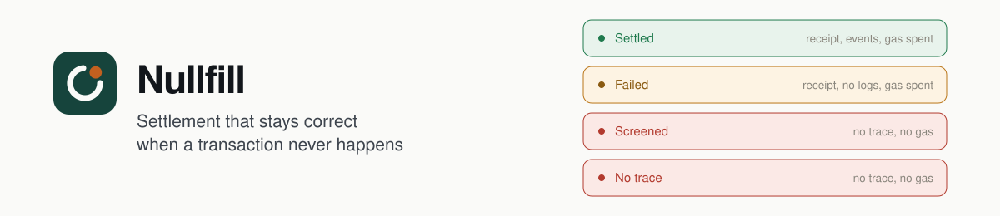
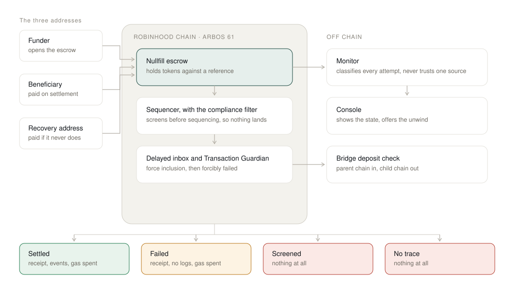

<p align="center"></p>

<p align="center"><strong>An escrow for tokenised equities that stays correct when a transfer is never sequenced at all.</strong></p>

<p align="center"><a href="https://iamrobertmoore.github.io/Nullfill/">Open the settlement console</a> · <a href="https://iamrobertmoore.github.io/Nullfill/#classifier">Classify a transaction</a> · <a href="https://explorer.testnet.chain.robinhood.com/address/0x71029fac49E9b45CCC377812aEc01509FFD383A1">Deployed contract</a> · <a href="contracts/src/Nullfill.sol">Read the contract</a> · <a href="https://iamrobertmoore.github.io/Nullfill/deck/">Pitch deck</a></p>

Ines runs settlement at a six-person desk that quotes tokenised equities on Robinhood Chain. Trades settle in escrow: her desk puts up the stock tokens, the counterparty puts up the cash, and the contract releases both when the trade completes.

The trouble is that on Robinhood Chain a submitted transaction has four possible fates, not two. Besides executing and reverting, it can be screened at the sequencer, in which case it is never sequenced at all. No revert, no receipt, no event, no gas. Her contract cannot see that anything was attempted. Neither can the counterparty, the indexer, or the auditor.

So when a settlement does not complete, Ines is left with a question she cannot answer for a day. Is this late, or is it never coming? Release the escrow early and she risks paying twice. Wait, and her capital sits idle. And the list that decides this is private: addresses are stored as salted hashes, so nobody can check in advance whether an address, or a counterparty's address, is on it. If the one party an escrow depends on cannot get a transaction in, whether that is screening or an outage, a conventional escrow simply waits, forever.

## The problem, counted

**A screened transfer leaves 0 bytes of on-chain trace, and the chain gives you 24 hours before you may treat it as gone.**

**And it is not a small pool of money.** 672.9 million USDG sits on Robinhood Chain mainnet, read from the token contract at block 74,889,519 on 28 September 2026. Every escrow, loan and payout that holds it assumes a transaction either lands or reverts.

**And the filter is switched on, on mainnet.** Robinhood Chain keeps a registry of the transactions its compliance filter refused, at the ArbOS precompile `0x74`, and anyone can read it. Between 30 June and 16 September 2026 it recorded 1,355 of them, across 6,096 registration events from a single registrar. Every one I sampled was included and failed, which is how a filtered transaction that comes in through the delayed inbox ends. And those are only the ones that took that route. A transaction refused at the sequencer's door isn't counted anywhere.

Both numbers in bold above are sourced rather than estimated. The zero is a property of the mechanism: the transaction is rejected before sequencing, so there is no receipt to find. The 24 hours is the Arbitrum force inclusion window, the period during which a transaction that was screened can still arrive by another route. Unwinding an escrow before that window closes is not caution, it is a bug, because the late arrival would settle on top of the refund.

## Try this

| Try this | Watch what happens |
|---|---|
| [Classify a transaction](https://iamrobertmoore.github.io/Nullfill/#classifier) | Paste any Robinhood Chain hash. The console reads a real receipt and tells you which of the four states it is in, and says plainly when it cannot tell. |
| [Open a screened escrow](https://iamrobertmoore.github.io/Nullfill/#detail-panel) | The escrow is untouched and still open. Nothing was spent, and nothing is recorded anywhere on chain. |
| [A bridge deposit that arrived nowhere](https://iamrobertmoore.github.io/Nullfill/#recovery-panel) | ETH left Ethereum, no credit landed on Robinhood Chain, and no system on either chain will ever mention it. |

## Real USDG, through the live contract

Two orders, 50 USDG each, from the Paxos testnet faucet, through the deployed contract on 28 September 2026. Every row is a transaction you can open.

| Order | What happened | Transactions |
|---|---|---|
| 1 | Opened, then settled. The counterparty ends up holding the 50 USDG and the order is closed. | [open](https://explorer.testnet.chain.robinhood.com/tx/0xaf53bd4607b7ef088d9d80c02701d742f51c7f7b2518e9e2694d57fd9f0573f4) · [settle](https://explorer.testnet.chain.robinhood.com/tx/0xb3c300d0c5040e7d1023376fb860cdd8f3e1abf7cc8aa06104d7b713d3b8d173) |
| 2 | Opened with a recovery address nominated up front. The contract will not let anyone unwind it until the 24 hour window has passed, at 15:30 BST on 29 September. After that, a wallet that has never touched the order unwinds it, and the USDG goes to the recovery address, not to whoever pressed the button. | [open](https://explorer.testnet.chain.robinhood.com/tx/0x1fa994e04fea8a82ab3550a12529f2c6c2907911e5eeede870ff527680265bfe) |

Order 2 is the whole argument in one transaction. If the funder had been screened, the funds would still come home, because recovery never needed the funder to send anything.

## I checked the settlement contracts in this buildathon

Seventeen projects in this buildathon's field hold user funds on Robinhood Chain while they wait for something: a repayment, an expiry, a claim. I could find public contract source for eight of them, so I read those eight, one function at a time.

- **None of the 8** has any logic for a transaction that is rejected at the sequencer.
- **3 of the 8** move value because a transaction did not arrive by a deadline, and in **2** of those the deadline can be set shorter than 24 hours, inside the window in which the missing transaction can still arrive.
- **1 of the 8** floors its grace period at 24 hours, and says why in a comment: so an outage cannot cost a borrower their collateral. That is the same window Nullfill enforces, arrived at independently.

I am not naming anyone. These are other builders' entries, not bugs to report in public, and the point is the pattern: on this chain, "no transaction arrived" is treated as a decision almost everywhere, and it is not one.

## The problem, in the chain's own words

This is not a hypothetical I invented. Robinhood Chain documents the behaviour in the present tense, in a page about how the chain differs from Ethereum:

> Robinhood Chain maintains compliance standards through sequencer-level screening. While rare, this mechanism can influence smart-contract execution; for instance, any transaction associated with a sanctioned address will be excluded from inclusion. Standard read operations, such as `eth_call`, `eth_getLogs`, or balance queries, remain fully accessible and unaffected. Since a blocked transfer is never processed, it simply appears as though the event never occurred, ensuring indexers remain synchronized with the actual state.

Read the last sentence again. It is offered as a reassurance, and for an indexer it is. For anyone holding funds in escrow it is the bug.

The mechanism is Arbitrum's, introduced in ArbOS 61 and off by default. Robinhood turned it on, and their documentation links directly to Arbitrum's compliance filtering page. TRM Labs appears on the Robinhood Chain ecosystem page under Compliance and Risk Management, which is the same role Arbitrum's documentation names for the address list provider. So this is a mechanism with a named supplier, running on a live chain, described by both parties.

I reproduced it locally before writing any Solidity, on a Nitro testnode with the filter genuinely enabled. A transaction from a restricted address is rejected with `-32000 Transaction rejected by chain policy`. A transaction to a restricted address is rejected the same way. A balance query on a restricted address works perfectly. A control transaction between two unrestricted addresses succeeds. The full setup, including the three places where Arbitrum's documentation is wrong, is in [`docs/reproduction.md`](docs/reproduction.md).

Then I checked mainnet itself. The second layer, the one that fails a filtered transaction arriving through the delayed inbox, is live there, and it leaves a record: a failed receipt, and the transaction's hash in the registry at `0x74`. The console's classifier reads that registry, so paste a mainnet hash and it tells you whether the chain filtered it. The first layer, the sequencer's door, still leaves nothing, which is the case Nullfill is built for.

## The failure the contract cannot fix, and the monitor that can

There is one path where this gets worse than a stalled settlement, and Arbitrum's own security notes describe it:

> If a restricted address deposits ETH via `depositEth()` on the parent chain, the ETH enters the bridge contract on the parent chain before any filtering occurs on the child chain. If the corresponding credit is dropped on the child chain, the ETH may become locked in the bridge with no corresponding child chain asset. Chain owners should account for this in their compliance design and user communication strategy.

Money leaves the wallet. It arrives nowhere. It is locked in a bridge contract, and the documentation's answer is that the chain owner should have a communication strategy about it. That strategy does not exist. Nothing on either chain will tell the user, because on the child chain nothing happened.

No contract can fix this, because the failure is on the other side of the bridge. So the console watches for it instead, matches parent chain deposits against child chain credits, and produces the evidence. That is the third panel on the page.

## Nullfill Watch, alpha

A screened transaction exists in exactly one place: the error the RPC returned to whoever sent it. Nothing on chain will ever record it. [`watch/`](watch/) keeps that record. No dependencies, Node 22.

```bash
node watch/nullfill-watch.mjs proxy --rpc https://rpc.testnet.chain.robinhood.com --port 8646
```

Point a wallet or script at `http://127.0.0.1:8646`. Everything passes straight through, and every `eth_sendRawTransaction` gets a receipt signed with the watcher's Ed25519 key: the raw transaction, its hash, what the RPC said, and when. The sender still sees the real error. The receipt is what they can show a counterparty afterwards.

```bash
node watch/nullfill-watch.mjs escrows --address 0x1f73e798AcC33eb93Eb61825591d9b73C7Ee7D4A
node watch/nullfill-watch.mjs verify web/data/sample-receipt.json
```

And for the refusals the chain does record, it asks the chain:

```bash
node watch/nullfill-watch.mjs filtered --rpc https://rpc.mainnet.chain.robinhood.com \
  --hash 0x3557fe4ab79553ae32f49af938d6596335aa42d68742bdfc73490d2261e3dbf5
# filtered: the chain's registry lists it, and it was included and failed (gas used 20000000)
```

`escrows` lists every Nullfill escrow an address is party to, read from the contract's events, with how long until anyone may unwind it. `verify` checks a receipt's format, that its hash really is the keccak256 of its raw transaction, and the signature.

[`web/data/sample-receipt.json`](web/data/sample-receipt.json) is real: the live Robinhood Chain RPC refused that transaction on 28 September 2026. It was refused for a stale nonce, not screening, because nobody can make the live chain screen on demand. The capture path is the same one a screening rejection takes. The console verifies it in your browser, and has a button that changes one word so you can watch the signature fail.

## How it works



**The escrow holds tokens against a reference.** A reference can only be used once, and every state transition is one way, so a retried transaction cannot pay out twice. This matters more than usual here, because the natural human response to a transaction that did not land is to send it again.

**Unwind is permissionless.** Anyone can release an expired escrow to the recovery address. This is the single most important decision in the contract. The conventional pattern, "if the seller has not delivered by the deadline I will send myself the money back", requires the funder to be able to send a transaction. If the funder is the screened party, they cannot, and the funds are stuck forever. Making recovery permissionless means it never depends on the person most likely to be blocked.

**The recovery address is nominated before it is needed.** It is set when the escrow opens and can be changed while the escrow is still open. A desk whose primary address is restricted names a different address in advance, rather than discovering the problem when they can no longer transact.

**Both parties can settle, and the deadline only gates the refund.** If the beneficiary has been screened and cannot transact, the funder can still complete the settlement, and the tokens still go to the beneficiary. A late settlement is still a settlement, so settling remains available after the deadline. Only the refund is time gated.

**Every deadline is at least 24 hours out.** The contract enforces this, because it is the force inclusion window. A screened transaction can still arrive through the delayed inbox during that period, and Arbitrum closes that route deliberately with the Transaction Guardian precompile: a restricted transaction that does arrive is forcibly failed on inclusion and burns its attached gas. So force inclusion is not an escape hatch. It is a way to spend gas learning that you are blocked.

## The assets this settles

A settlement on this chain has two legs. Tokenised equity one way, dollars the other. The dollars are **USDG**, and that is not a choice made here to please anyone. It is the dollar Robinhood Chain names on its own ecosystem page, under Stablecoin, supplied by Paxos. The same page names TRM Labs as the compliance and risk management partner, so the chain's own partner list carries both the filter and the dollar.

The contract is asset agnostic for any token that transfers exactly what it is asked to. `open()` takes any `IERC20`, so nothing changes if a desk settles in a different dollar. Tokens that keep a fee on transfer are the exception, see the limits below. What does not come for free is knowing which contract is the real one, so [`contracts/src/RobinhoodChain.sol`](contracts/src/RobinhoodChain.sol) pins the canonical addresses for both chains and the five verified testnet equities. Every address in it was read back from the chain rather than copied from a page.

**USDG is six decimals, not eighteen.** A desk escrowing 2,500 USDG is moving the integer `2500000000`, and a rounding step anywhere in that path is real money. So the property is stated once and fuzzed:

> Every micro-dollar that goes into a USDG escrow comes out again, to the unit, whichever way it leaves, and the escrow keeps nothing.

Two limits, stated rather than discovered.

**Testnet USDG comes from the Paxos faucet, 100 per wallet per day.** The token itself has a role gated `mint` and no public one, so this project cannot create USDG, only receive it. The two orders above used faucet USDG. The unit tests use a six decimal stand-in that mirrors the real interface, and [`test/Fork.t.sol`](contracts/test/Fork.t.sol) reads the real contract on chain.

**A hand-written decimal count is a claim, not a constant.** A token can be upgraded. The fork test re-reads every entry in the registry against a live chain and fails if any of them has moved.

## What this will not claim

Six limits, stated here rather than discovered by a reviewer.

**The deployed escrow assumes the token transfers exactly.** `open()` records the amount it was asked to escrow and does not measure what arrived. A token that keeps a fee on transfer would leave that order recorded whole while the escrow held less. USDG and the five testnet equities all transfer exactly, so nothing this entry settles in is affected. The fix, a balance delta check, is written and tested, and it ships with the next deployment rather than a redeploy in the last week of the buildathon. [`test/RobinhoodChain.t.sol`](contracts/test/RobinhoodChain.t.sol) pins the current behaviour down so the limit is stated by the suite as well as here.

**The chain only records some refusals.** A filtered transaction that comes in through the delayed inbox is included, failed, and listed in the registry at `0x74`, so the console can name it. One refused at the sequencer's door is recorded nowhere.

**A refusal at the door is only observable at submit time.** If you did not send the transaction, you can never be certain it was screened rather than dropped. From outside, both leave nothing at all, and the console says so instead of guessing.

**The restricted address list is private, and should be.** Addresses are stored as salted hashes precisely so the list cannot be enumerated. Nothing here tries to reverse it and nothing here can tell you whether a given address is on it.

**Nullfill does not route around screening, and cannot.** Every transfer it makes is screened like any other: an unwind that would pay a restricted address is rejected at the sequencer exactly as a direct transfer would be. What it changes is who has to act, and when it is safe to act, not what the filter allows.

**Screening happens before execution, so the EVM cannot catch it.** A transfer to a restricted recovery address does not revert, it simply never runs. `try`/`catch` cannot help, and no contract can detect this from the inside. That is exactly why the recovery address has to be nominated in advance, and it is a real limitation rather than a design choice.

## Build and run

The console is static. No build step, no dependencies:

```bash
cd web && python3 -m http.server 8080
```

Then open `http://localhost:8080`. The live classifier works against Robinhood Chain testnet out of the box, and it will point at mainnet or a custom RPC from the dropdown.

The contract needs Foundry:

```bash
cd contracts
git submodule update --init --recursive
forge test
```

46 tests, four of them fuzzed, all passing. I also mutated the contract fourteen ways, one change at a time: removing the deadline check, letting only the funder unwind, sending the refund to the funder instead of the nominated address, and so on. Thirteen were caught by at least one test. The one that survived was halving the 24 hour window, because every test read the window from the contract instead of stating it. There is now a test that states it. Four more run against a live chain and report as **skipped** rather than passed when there is no RPC, which is deliberate: a network check that quietly reports success when it did not run reads as evidence.

```bash
FOUNDRY_PROFILE=fork ROBINHOOD_RPC=https://rpc.testnet.chain.robinhood.com forge test --match-path test/Fork.t.sol
```

The `fork` profile raises the EVM version to Cancun, and it is required rather than optional. The live tokens use `PUSH0` and this project deploys Paris bytecode, so without it every call to a real token fails with `EvmError: NotActivated`. The default stays Paris on purpose: the deployed contract is Paris bytecode and Paris bytecode runs on any chain at or above it.

There is one more check, and it is the one that matters most. It asserts that the bytecode on chain is what this repository compiles to, because a repository that does not match its own deployment is worse than a contract missing one hardening:

```bash
ROBINHOOD_RPC=https://rpc.testnet.chain.robinhood.com forge test --match-path test/Deployment.t.sol
```

Run it under the default profile, not the fork profile, so the comparison is against the bytecode this project actually deploys.

To deploy to Robinhood Chain testnet:

```bash
cd contracts && forge script script/Deploy.s.sol:DeployNullfill --rpc-url https://rpc.testnet.chain.robinhood.com --private-key $PRIVATE_KEY --broadcast
```

The contract takes no constructor arguments and has no owner. A deployment is just the bytecode, and there is nothing to configure afterwards.

It is live on Robinhood Chain testnet at [`0x71029fac49E9b45CCC377812aEc01509FFD383A1`](https://explorer.testnet.chain.robinhood.com/address/0x71029fac49E9b45CCC377812aEc01509FFD383A1). `FORCE_INCLUSION_WINDOW()` returns `86400`, and `statusOf()` on an unknown reference returns `0`.

To drive one real order against that deployment, [`script/Demo.s.sol`](contracts/script/Demo.s.sol) takes one environment variable per step:

```bash
DEMO_ACTION=status forge script script/Demo.s.sol:Demo --rpc-url $RPC --sender 0x0000000000000000000000000000000000000000
```

`status` reads and needs no key. `open`, `settle` and `unwind` broadcast. It resolves the settlement asset itself, preferring USDG when the wallet is funded with it and falling back to the first equity the wallet holds, and it says which one it chose. A silent choice of asset is exactly the thing a reviewer would want to check.

## Prior art, and what is actually new

The mechanism is not mine. Arbitrum documents compliance filtering, Robinhood Chain documents that it is on, and Chainstack Labs publishes a sequencer feed decoder that names the same failure in its own risk warnings. None of that is a claim to novelty, and the honest version of this section names what already exists.

**Idempotent escrow already exists.** Paylock, built on Arbitrum Sepolia during this buildathon, rejects a second payment against a settled invoice with `already_settled`. Replay protection has been arrived at independently by more than one entry in this field, so it is not a differentiator, and this README does not lead with it. It appears here as one of four consequences of keying orders by an external reference.

**Deadline based release already exists.** Stagepay releases escrowed milestones to a freelancer when a review window passes in silence, and its suite fuzzes fund conservation over 2,000 runs. Nullfill has the same shape and the same test discipline, and the difference is the argument rather than the mechanism. Silence past a deadline is treated there as a decision. The claim here is that on this chain an absent transaction is not a decision, and acting on it before the force inclusion window closes is the bug.

**What does not exist** is anything that treats non-inclusion as a first class settlement outcome. A keyword sweep of the 96 projects in this buildathon's field on 29 September 2026 returns zero hits for `force inclusion`, `non-inclusion`, `restricted address`, `censorship` and `settlement finality`. One other entry works with the compliance filter, reading the same registry to verify corporate action updates. None treats a missing transaction as a settlement outcome. Every escrow on every chain assumes a submitted transaction either lands or reverts. This one handles the third case, where it never happened, and names the two things that follow: recovery must not depend on the screened party transacting, and no deadline may sit inside the force inclusion window.

That is the claim. It is narrower than "nobody has thought about compliance on this chain", which would be false, and it is the one the code supports.

## Checking every claim on this page

Every number and address above can be checked rather than believed. This table is the list.

| Claim | How to check it | What you should see |
|---|---|---|
| **The deployment is this source** | `ROBINHOOD_RPC=https://rpc.testnet.chain.robinhood.com forge test --match-path test/Deployment.t.sol` | 2 passing. This compares the bytecode on chain against what the repository compiles to, and it fails loudly if they diverge. |
| The contract is deployed and the window is 24 hours | `cast call 0x71029fac49E9b45CCC377812aEc01509FFD383A1 "FORCE_INCLUSION_WINDOW()(uint64)" --rpc-url https://rpc.testnet.chain.robinhood.com` | `86400` |
| USDG is at that address and is six decimals | `cast call 0x7E955252E15c84f5768B83c41a71F9eba181802F "decimals()(uint8)" --rpc-url https://rpc.testnet.chain.robinhood.com` | `6` |
| Every address in the registry still matches the chain | `FOUNDRY_PROFILE=fork ROBINHOOD_RPC=https://rpc.testnet.chain.robinhood.com forge test --match-path test/Fork.t.sol` | 3 passing |
| The contract's own test suite | `cd contracts && forge test` | 46 passing, 4 skipped |
| A real USDG order settled | `cast call 0x71029fac49E9b45CCC377812aEc01509FFD383A1 "statusOf(bytes32)(uint8)" 0xfad69ced7f9b1bf95844435440a669de0644dfbf7a378f571f412529e599acee --rpc-url https://rpc.testnet.chain.robinhood.com` | `2`, which is Settled |
| The console's own test suite | `cd web && npm test` | 26 passing |
| Mainnet's filter refused a real transfer | `cast call 0x0000000000000000000000000000000000000074 "isTransactionFiltered(bytes32)(bool)" 0x3557fe4ab79553ae32f49af938d6596335aa42d68742bdfc73490d2261e3dbf5 --rpc-url https://rpc.mainnet.chain.robinhood.com` | `true`. The receipt for that hash shows it included and failed. |
| The watcher's test suite | `cd watch && npm test` | 5 passing |
| A real refusal, signed and checkable | `node watch/nullfill-watch.mjs verify web/data/sample-receipt.json` | three `ok` lines |
| The asset panel really checks the chain | Open the deployed console and read the right hand column | Six rows, each saying what the chain said |
| The screening behaviour is real | [`docs/reproduction.md`](docs/reproduction.md), run the command in it | `-32000 Transaction rejected by chain policy` |
| The quotes are the chain's words | The four links under Sources | Each quote appears on the page linked |

Two of those rows are skipped rather than passed when there is no RPC, and one of them is the row that
matters most. A check that reports success when it did not run is worse than no check, so the counts
above name the skips rather than hiding them.

## Corrections

Claims this repository published and then changed. Kept because a correction is more useful than a silent edit, and because the list is the honest measure of how much of the rest survived checking.

**29 September 2026.** This README said a failure receipt cannot tell you why it failed. For the filter's own refusals on mainnet, it can: the chain lists them at `0x74`, and the classifier now reads that list. The limit is rewritten above as what is still true, that a refusal at the sequencer's door leaves no record at all.

**28 September 2026.** This README said the local reproduction was "written up in the repository history". It was not. No commit and no file mentioned it. The writeup now exists at [`docs/reproduction.md`](docs/reproduction.md), and the sentence points at it. The claim was true about the work and false about the record.

**28 September 2026.** The test count above said 29. It was 29 when written and 44 by the time anyone read it, because a second test file was added. A count is only meaningful with a date attached, and it had none.

**28 September 2026.** The deposit path accepts an amount without checking what arrived, so a fee on transfer token would leave one order able to spend another order's balance. Found while writing the USDG tests. I wrote the fix, a balance delta check, and then took it back out of this repository, because shipping it meant redeploying the contract in the last week of the buildathon and the repository would otherwise no longer match its own deployment. The limit is now stated under "What this will not claim", pinned by a test, and the fix ships with the next deployment.

**28 September 2026.** An earlier version of this README said the route to testnet USDG was undocumented. It is documented: Paxos runs a testnet faucet that covers Robinhood Chain, 100 USDG per wallet per day. The two live orders above were funded from it.

## Who pays, and where this goes next

**Who it is for.** Anyone holding funds on Robinhood Chain against a future event: OTC desks settling tokenised equities against USDG, lending protocols with a repayment deadline, protection notes with an expiry, savings pools with a payout date. The survey above found eight such contracts in one buildathon alone.

**What stays free.** The escrow. It is MIT licensed, has no owner and no fee, and any team can deploy it or copy the three rules into their own contract: recovery never depends on one party transacting, the refund address is named up front, and no deadline sits inside the 24 hour window.

**What I will charge for.** The watcher. The alpha is in the repo today (above); the hosted version is the product. A screened transaction exists in exactly one place, the error returned to whoever sent it, and nothing on chain will ever record it. The alpha already sits between a desk and the RPC, keeps that rejection as a signed, timestamped receipt, and lists every open escrow against its deadline. The hosted version adds alerts and matches parent chain bridge deposits against child chain credits; the bridge panel on the console today is a recorded example of what it looks for. **$99 a month per desk, up to 25 watched addresses**, with the classifier on this page free for everyone. What grows is the number of watched addresses, and it grows with the USDG on the chain.

**Roadmap.**

1. **Now.** Nullfill Watch alpha, in [`watch/`](watch/): signed receipts for refused transactions, and escrow deadlines per address.
2. **October 2026.** Deploy v1.1 with the exact-deposit guard. Hosted Watch with alerts.
3. **November 2026.** Publish the three rules as a small Solidity library other settlement contracts can inherit, with the tests that prove each one.
4. **Q1 2027.** External audit, then Robinhood Chain mainnet. Apply to the Arbitrum D.A.O. Grant Program, which funds exactly this kind of primitive: small, verifiable, and useful to other teams on the chain.

## Sources

Every claim above is quoted from a primary source, checked on 15 September 2026.

- Robinhood Chain, [Differences from Ethereum](https://docs.robinhood.com/chain/differences-from-ethereum/), the Transaction screening section
- Arbitrum, [Compliance filtering](https://docs.arbitrum.io/launch-arbitrum-chain/configure-your-chain/advanced/compliance-filtering), including the force inclusion protection and parent chain bridge deposit notes
- Arbitrum, [Compliance filtering](https://docs.arbitrum.io/launch-arbitrum-chain/chain-config/sequencer/compliance-filtering) configuration reference, the address list schema
- Robinhood Chain, [About](https://docs.robinhood.com/chain/), the ecosystem partner list

Built for the Arbitrum Open House Singapore online buildathon.
